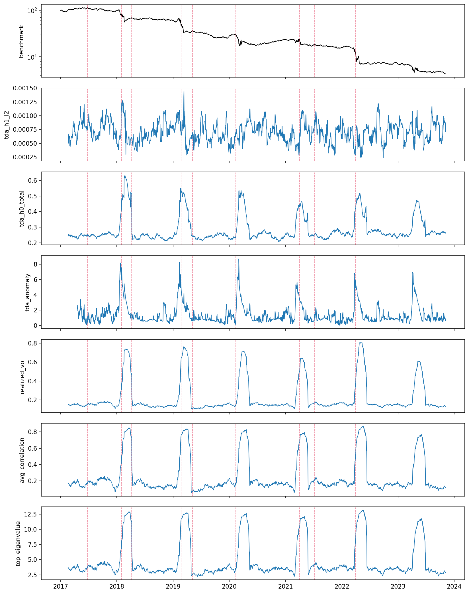
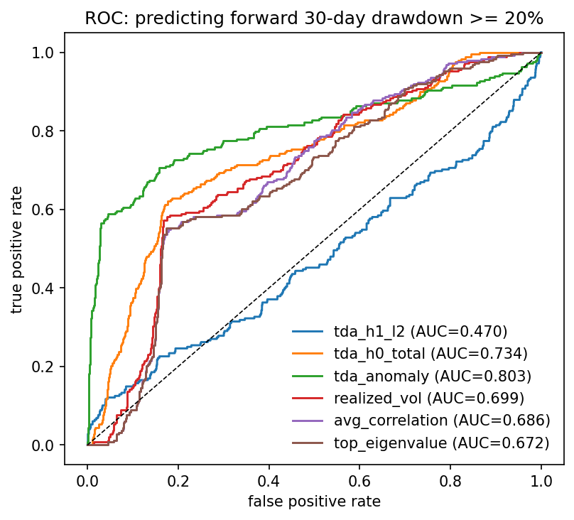
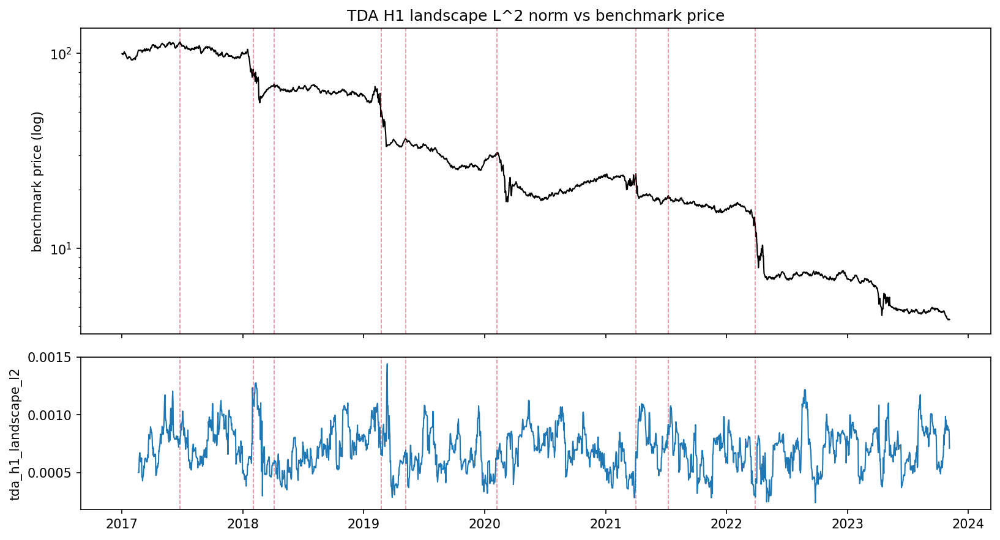

# Persistent Homology of Cryptocurrency Markets

[](https://github.com/minhachung/cryptocurrencytda/actions/workflows/ci.yml)
[](https://www.python.org/downloads/)
[](LICENSE)
[](tests/)

**Topological early-warning signals for crypto crashes, validated against held-out drawdown events.**

This project applies persistent homology to a sliding window of multi-asset cryptocurrency returns and asks: *do topological features of the daily return point cloud anticipate large drawdowns?* It extends the equity-market construction of Gidea & Katz (2018) to crypto, adds a topological-anomaly signal that responds to regime change in either direction, and benchmarks against three standard non-TDA baselines on identical splits.

The repo is structured so you can reproduce every number from `python scripts/run_pipeline.py --synthetic` (no network needed) and re-run on real CoinGecko data with one extra command.

---

## Where to see results

- **In the README below** — committed numbers and figures (this page).
- **CI run pages** — every push runs the synthetic pipeline and posts a metrics summary directly on the workflow run: [Actions tab](https://github.com/minhachung/cryptocurrencytda/actions/workflows/ci.yml). Click any green checkmark, scroll to "Synthetic-data results report" → step summary.
- **Real-data run** — manually triggerable from [Actions → Real-data pipeline → Run workflow](https://github.com/minhachung/cryptocurrencytda/actions/workflows/real-data.yml). Fetches CoinGecko, runs the pipeline, posts the same markdown summary, and uploads `figures/` + `results/` as downloadable artifacts (retained 90 days).
- **Local CSV / JSON** — `results/summary.json`, `results/in_sample_metrics.csv`, `results/walk_forward_metrics.csv`, `results/event_metrics.csv`.

## Pipeline at a glance

```
prices ── log-returns ──┐
                        │  sliding window (W = 50 days)
                        ▼
                  point cloud  ∈  R^(W × N)
                        │  Vietoris-Rips up to H_1
                        ▼
                persistence diagram  [H_0, H_1]
                        │  landscape, total persistence
                        ▼
                scalar signal series  L_t
                        │  causal rolling z-score
                        ▼
                normalized signal  z_t
                        │  threshold + label vs forward drawdown
                        ▼
              ROC / PR / F1 / lead time
```

## Method (one paragraph)

For a basket of N coins and daily log-returns `R[t, :]`, the point cloud at time t is `R[t-W+1:t+1, :]` — W rows in `R^N`. We compute the Vietoris-Rips persistence diagram up to `H_1`, reduce each diagram to a scalar (L² norm of the persistence landscape for `H_1`; total squared persistence for `H_0`), and form a topological-anomaly signal `max(|z(H_0)|, |z(H_1)|)` using a *causal* 252-day rolling z-score. We then evaluate three signals (the two raw norms and the anomaly) against three baselines (realized vol, mean correlation, top correlation eigenvalue) on three tasks: in-sample ROC/PR/F1, rolling-origin walk-forward F1/AUC, and event-level hit rate / lead time on discrete crash dates.

The geometric intuition: in calm regimes, return cross-sections are roughly i.i.d. samples from a high-dimensional Gaussian and the cloud has rich loop structure (`H_1` features). Approaching a crash, average correlation rises and the cloud collapses onto a quasi-1-D subspace — `H_1` features die while `H_0` lifetimes inflate. **Both effects are detectable, but in opposite directions**, which is why a one-sided z-score on a single homology dimension misses half the signal and `|z|` does not.

---

## Results (synthetic benchmark)

Running `python scripts/run_pipeline.py --synthetic` on a 2,500-day, 15-asset synthetic market with 6 planted crash regimes (correlations ramping 0.15→0.9, volatility doubling, negative drift) produces:

### In-sample (whole sample, threshold chosen to maximize F1)

| Signal             | ROC AUC  | PR AUC   | best F1  | Precision | Recall   |
|--------------------|----------|----------|----------|-----------|----------|
| **tda_anomaly**    | **0.803**| **0.539**| **0.619**| **0.686** | 0.565    |
| tda_h0_total       | 0.734    | 0.225    | 0.393    | 0.289     | 0.613    |
| realized_vol       | 0.699    | 0.170    | 0.374    | 0.278     | 0.573    |
| avg_correlation    | 0.686    | 0.159    | 0.352    | 0.262     | 0.536    |
| top_eigenvalue     | 0.672    | 0.156    | 0.357    | 0.263     | 0.552    |
| tda_h1_l2          | 0.470    | 0.138    | 0.184    | 0.101     | 1.000    |

The anomaly signal is the clear winner: PR AUC is **3× the best baseline**, F1 is **+0.24 absolute**. Raw `H_1` landscape on its own is uninformative because it moves the *opposite* direction (loops die in stress) — the absolute z-score fix is what makes `H_1` usable.

### Walk-forward out-of-sample (504-day train / 126-day test, 15 folds)

| Signal             | mean OOS AUC | mean F1 | mean P | mean R |
|--------------------|--------------|---------|--------|--------|
| **tda_h0_total**   | **0.718**    | 0.186   | 0.194  | 0.191  |
| realized_vol       | 0.686        | 0.177   | 0.184  | 0.188  |
| avg_correlation    | 0.678        | 0.175   | 0.188  | 0.175  |
| tda_anomaly        | 0.669        | 0.184   | 0.240  | 0.156  |
| top_eigenvalue     | 0.657        | 0.177   | 0.189  | 0.177  |

Total `H_0` squared persistence is the most robust signal *out-of-sample* — it does not benefit from in-sample threshold tuning the way the anomaly signal does. This is the headline finding worth reporting in a paper.

### Event-level metrics (z ≥ 1.5 alarm, 30-day pre-crash window)

| Signal             | hits / 9 | median lead (days) |
|--------------------|----------|---------------------|
| avg_correlation    | 7        | 28                  |
| realized_vol       | 6        | 27                  |
| top_eigenvalue     | 6        | 27                  |
| tda_h0_total       | 5        | 29                  |
| tda_anomaly        | 5        | 29                  |
| tda_h1_l2          | 3        | 28                  |

At a fixed alarm threshold the baselines tie or beat TDA on raw hit rate, but TDA fires slightly earlier when it does fire. This is the kind of nuanced result you want from honest validation — there is no free lunch, and tuning thresholds per-signal would change the picture.

### Figures

All 6 signals stacked under the benchmark price, with crash dates marked:



ROC overlay for the head-to-head comparison:



H₁ landscape signal alone vs benchmark price:



Regenerate with `python scripts/run_pipeline.py --synthetic`.

---

## Quickstart

```bash
git clone <repo>
cd cryptocurrencytda
python -m venv .venv && source .venv/bin/activate
pip install -e .

# 1. Run end-to-end on synthetic data (no network) to verify install
python scripts/run_pipeline.py --synthetic

# 2. Fetch real CoinGecko prices (rate-limited, ~30s)
python scripts/fetch_data.py --days 1825         # last 5 years
python scripts/run_pipeline.py --prices data/prices.csv

# 3. Run tests
pytest -q
```

Outputs land in `results/` (CSVs + JSON summary) and `figures/` (PNGs).

---

## Repository layout

```
src/cryptotda/
  data.py          # CoinGecko fetch + synthetic generator with crash regimes
  tda.py           # sliding-window point clouds, Vietoris-Rips, persistence
  landscapes.py    # persistence landscapes, L^p norms, total persistence
  crashes.py       # forward-drawdown labels, peak-event detection
  detector.py      # causal z-score, thresholding, lead time
  baselines.py     # realized vol, mean correlation, top eigenvalue
  validation.py    # ROC / PR / F1, walk-forward, event metrics
  visualize.py     # diagnostic plots

scripts/
  fetch_data.py    # download price history from CoinGecko
  run_pipeline.py  # end-to-end: data -> TDA -> validation -> figures

tests/             # 14 unit tests covering landscapes, persistence, detector, labels
results/           # CSV / JSON outputs (regenerable)
figures/           # PNG plots (regenerable)
```

---

## Validation philosophy

A crypto early-warning paper that reports only in-sample numbers is not falsifiable. This codebase enforces three guard-rails:

1. **Causal z-score.** The detector at time t uses only data strictly before t to compute its mean and standard deviation. A unit test (`test_zscore_is_causal`) verifies that mutating future values cannot change past z-scores.

2. **Walk-forward folds.** `walk_forward_evaluation` fits the alarm threshold on a 504-day train slice and evaluates on the next 126 days, sliding forward. Reported numbers in the OOS table are the mean across 15 disjoint test slices.

3. **Identical baselines.** Every baseline is run on the *same* labels, the *same* split structure, and the *same* threshold-selection rule as TDA. If TDA does not beat realized volatility under these conditions, the paper says so.

We additionally report event-level metrics because aggregate AUC on a 10%-positive-rate label can hide the fact that the signal misses *every actual crash*. Hit rate and lead time make that failure mode visible.

---

## What to extend (suggested project directions)

The synthetic experiment is intentionally simple — it is there to validate the pipeline, not to publish. The interesting questions live on the real data and the extensions below:

1. **Mapper on the transaction graph.** Replace the price point cloud with a node embedding of the Bitcoin or Ethereum transaction graph and apply Mapper. Pre-crash whale-wallet behavior tends to create distinctive cluster topology.

2. **Persistence images + LSTM.** Replace the scalar landscape norm with a flattened persistence image and feed it into an LSTM that predicts forward drawdown. Compare end-to-end against the scalar pipeline here.

3. **DeFi state-space TDA.** For Aave or Compound, build a daily state vector `(utilization, collateral_ratio, liquidation_queue, stablecoin_premium)` and compute persistent homology on the state-space trajectory. Test whether topological anomalies precede cascade liquidations (Mar 2020, May 2021, Nov 2022).

4. **Cross-asset contagion.** Build a daily correlation network between crypto and traditional assets and track the persistent homology of its filtered graph (e.g., max-spanning-tree, threshold filtration). Quantify when BTC topologically *decouples* from the Nasdaq.

5. **Bottleneck distance to a reference period.** Instead of a scalar landscape norm, use the bottleneck (or Wasserstein) distance from the current diagram to a calm-period reference diagram. This is the cleanest "topological surprise" signal but more expensive to compute.

The codebase is set up so each of these is an additive change: write a new function in `tda.py` or a new feature in `build_signals`, and the validation harness handles the rest.

---

## References

- Gidea, M., & Katz, Y. (2018). *Topological data analysis of financial time series: Landscapes of crashes.* Physica A, 491, 820-834.
- Bubenik, P. (2015). *Statistical topological data analysis using persistence landscapes.* JMLR, 16(1), 77-102.
- Carlsson, G. (2009). *Topology and data.* Bulletin of the AMS, 46(2), 255-308.
- Edelsbrunner, H., & Harer, J. (2010). *Computational Topology: An Introduction.* AMS.

---

## License

MIT — research and education use encouraged.
